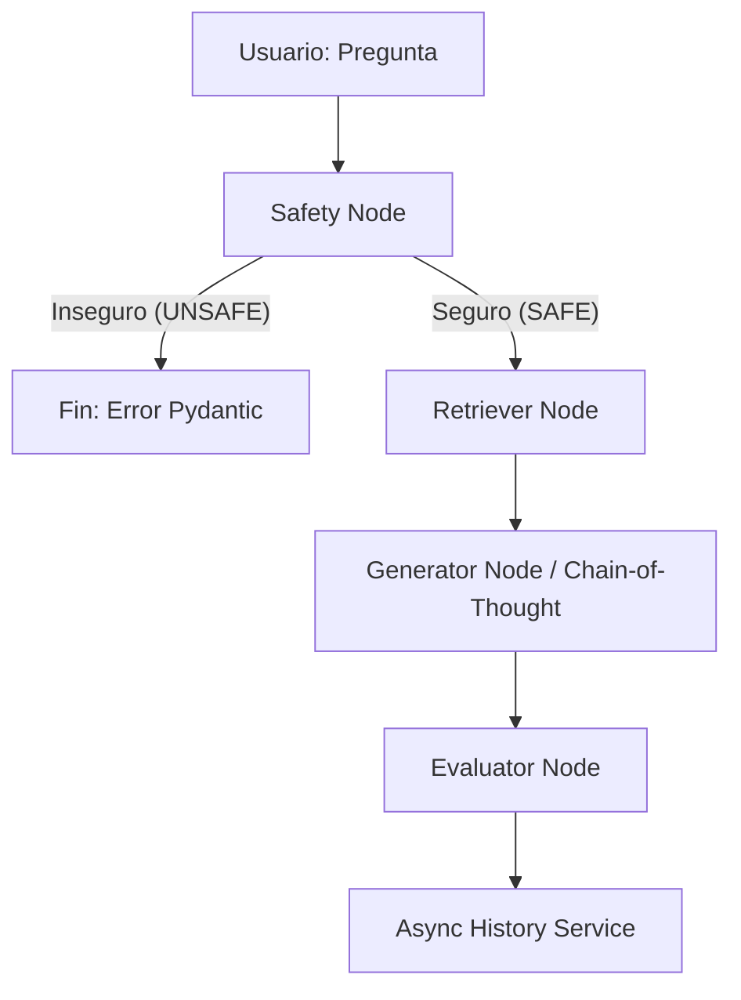

# Reporte de Arquitectura: FAQs RAG API

## 1. Visión General
El proyecto **FAQs RAG API** implementa un sistema estructurado de Generación Aumentada por Recuperación (RAG) empleando **LangGraph** como orquestador de estado. Su principal objetivo es escalar la respuesta automatizada de preguntas frecuentes de Recursos Humanos con alta fidelidad, asegurando seguridad, trazabilidad de telemetría y calidad de respuesta persistente.

## 2. Diagrama de Estados (LangGraph)
El pipeline utiliza grafos de estado transaccionales para enrutar el contexto a través de 4 micro-nodos principales:

## 3. Descripción de los Componentes Core

### 3.1. Safety Node (Filtro Preventivo)
Un pase primario por el LLM actúa como auditor inicial. Previene ataques de inyección de prompts y peticiones fuera de los parámetros de negocio, ahorrando tokens de embedding en caso de entradas maliciosas.

### 3.2. Retriever Node (Filtrado Semántico)
Cargado sobre **ChromaDB**, este nodo utiliza *RecursiveCharacterTextSplitter* (400 tokens / 40 sobrelapamientos). Extrae un clúster inicial de los 5 trozos más probables, pero ejecuta un **filtro in-memory pre-generación descartando todo resultado con score menor al 80%** para conservar la precisión estricta. Conserva hasta un `top_k=3`.

### 3.3. Generator Node (CoT Estratégico)
Se impone al LLM un formato semántico rígido, promoviendo transparencia en cómo abordó el problema:
1. Análisis técnico
2. Estrategia
3. Riesgos
4. Solución
Esto mitiga estadísticamente el sesgo de alucinación inherente al procesamiento de datos.

### 3.4. Evaluator Node 
Un auditor retrospectivo que evalúa numéricamente (0-10) la respuesta creada **frente al conocimiento inyectado original**, dictando una justificación que asegura que la procedencia es limpia y no tiene sesgos foráneos.

## 4. Persistencia y Observabilidad (Multi-Provider)
- **Agnosticismo de Modelos:** Integración mediante el principio Factory (`app/services/vertex_service.py`), permitiendo mutar velozmente entre OpenAI y Google Vertex AI a través del archivo de configuración `.env`.
- **Background Tasks:** El `history_service.py` intercepta el payload (`latencia`, `uso de tokens`, `hash`) y lo dispara subprocesado asíncronamente; evitando frenar la experiencia HTTP del usuario al salvar métricas y registrar iteraciones de sample estricto sobre `outputs/sample_queries.json`.

## 5. Conclusión
El uso de flujos ruteados estáticamente con LangGraph junto con una capa de Factory multi-proveedor brinda una fundación limpia y lista para escalarse, asegurando resiliencia mediante evaluaciones cruzadas de calidad (Safety y Evaluator).
